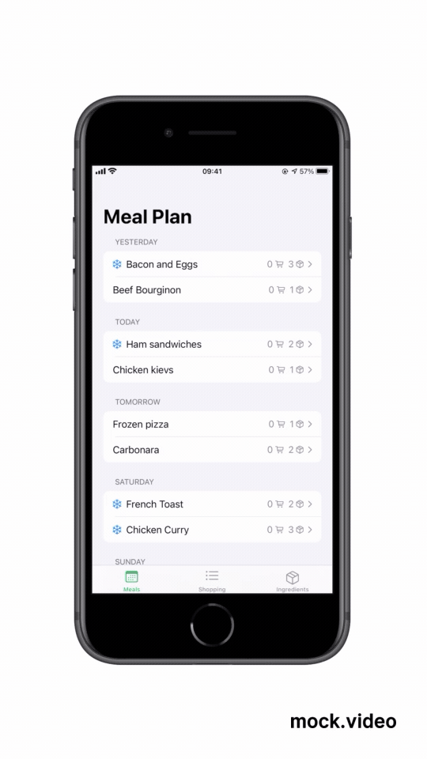
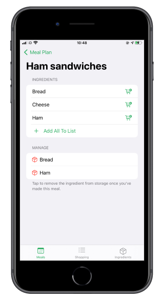
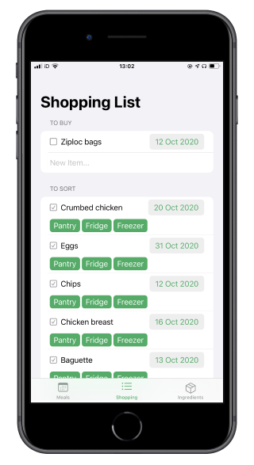
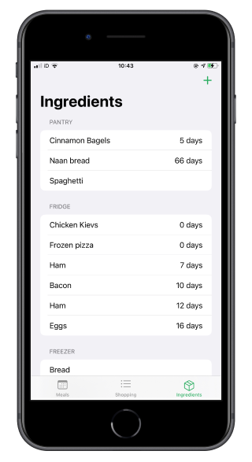

# FoodMate
FoodMate is a simple iOS app to manage meal prep. With it, you can  
* Schedule meals for days in the future
* Add ingredients for upcoming meals to your shopping list
* Keep track of the expiry dates of your ingredients

FoodMate provides lots of convenient little features to make managing your ingredients frictionless. It's charmingly bespoke&mdash;I created it to help me manage my own cooking at university so it's heavily biased towards the way I go about meal prep.

## An Informal Tour

FoodMate is mostly built using SwiftUI but the meal planner view is a `UICollectionViewController` to enable drag-and-drop reordering between sections on iPhone. Data is stored persistently using Core Data. No third party libraries were harmed in the making of this app (because I didn't use any). All the types in the code have doc comments if you'd like to browse but know that FoodMate is still in early development so naturally it's a little rough in many places.

FoodMate is split into three main sections which I'll highlight by walking you through how I use the app.

#### The Meal Planner
Here you can create new meals and assign ingredients to them. Each day gets a lunch and dinner slot, and you can use drag and drop to move meals between days and slots. I use this to throw down ideas for what I can make this week and rearrange them into something that suits my schedule. FoodMate also takes advantage of context menus here, providing the option to push all meals of a kind (lunch or dinner) backwards or forwards between days to make some room in the planner. When I'm done, I'll tap on each meal to visit a detail view where I can quickly add the ingredients I need for the meal to the shopping list. FoodMate recognises items that are already on the list (for example, in case two recipes use the same ingredients) and items that I already have in the kitchen.

#### The Shopping List
Once the meal planning is complete, the shopping list is already filled with the ingredients I need to buy. As I add items to my cart, I make a note of the item's expiry date (if applicable) before checking it off. Back home, I can sort all my purchased items into different locations in the kitchen: pantry, fridge, or freezer (deleting the item if none are applicable).

#### The Kitchen
Having sorted my purchased ingredients, I can now view them all in the 'kitchen' where items are sorted by expiry date. (Keeping track of expiry dates was the primary motivation behind building FoodMate before I built the other features.) Sorting the ingredients into locations provides extra information that's useful later on&mdash;for example, when I schedule a meal that relies on a frozen item, FoodMate sends me notification the night before reminding me to defrost it. Once I've made a meal, I can go back to the meal planner and remove the consumed ingredients so everything's up to date.

## Roadmap
### v0.1
:white_check_mark: Autocomplete ingredients and meals when typing in their names  
:white_check_mark: Control shopping list and kitchen stores from meal planner  
:white_check_mark: Drag-and-drop meal reordering on iPhone  
:white_check_mark: Shift meals forwards and backwards by a day  
:white_check_mark: Suggest meals based on ingredients in the kitchen and time since last eaten  
:arrow_right: Defrost notifications  
[ ] Warn if a ingredient required for a planned meal will be expired at time of creation

### v0.2
[ ] Host all the Core Data entities in CloudKit  
[ ] Setup extensions (for a widget) if deemed useful

### v0.3
[ ] Add iPad support

### v0.4
[ ] Polish UI pending a potential App Store release (???)
